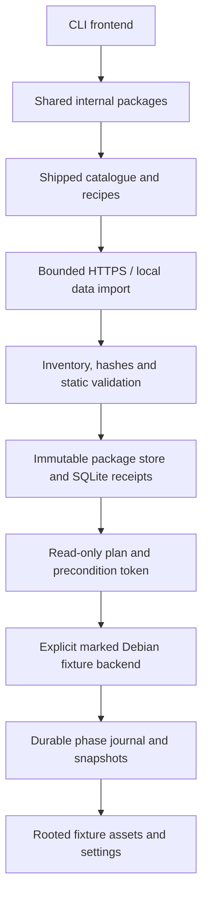

# GRUB Manager 0.1 architecture

Implementation decisions, 2026-10-05. The earlier audit/reuse plan is historical design evidence; this document describes the implemented subset.

## Boundaries

`cmd/grubmgr` contains only process entry/exit. `internal/cli` handles flags and presentation. `model`, `catalog`, `fetch`, `archive`, `fsx`, `validate`, `pf2`, `system`, `planner`, `state`, `backend`, `transaction`, and `preview` expose ordinary Go APIs for a later frontend. No module executes an external process. The build-time license checker is separate from the product.

The executable is MIT. Go supplies archive, compression, hashing, HTTP/TLS, image and JSON primitives. `modernc.org/sqlite` supplies a CGo-free SQLite driver. PF2 inspection and domain behavior were independently written: no ecosystem-manager source was adapted. The candidate upstream linter did not justify importing its unrelated installer or restrictive layout assumptions.

## Files and identity

| Location, relative to the chosen store | Role |
| --- | --- |
| data/packages/REVISION/content | Original data, including license notices |
| data/packages/REVISION/manifest.json | Immutable manifest evidence |
| data/.stage-* | Bounded ordinary-user staging, same filesystem as final package store |
| state/state.sqlite | Receipts, selected variants, installed/active/pinned flags and journals |
| config | Reserved configuration location; no configuration loader yet |
| cache | Reserved cache location; no persistent catalogue refresh yet |

The fixture equivalents are under `ROOT/.grubmgr`. Installed fixture assets live at `ROOT/boot/grub/themes/grubmgr/NAMESPACE/NAME/REVISION`. Every package file is copied, including notices. Versions are never overwritten. Content is checked again when planning and when staging/switching. The store is logically immutable; it is not protected against its owning user. Content modification is detected, not prevented by filesystem permissions.

SQLite uses full synchronous commits and rollback-journal mode. Read paths use `mode=ro` and do not create a missing database. SQL transactions make receipt/journal updates consistent inside the database; they do not make filesystem operations atomic. A directory promotion preceding a receipt update can leave an orphan after a crash; a later identical fetch verifies and adopts that content. Interrupted staging directories may need manual fixture cleanup; automatic GC is deferred.

## Planning

The planner reads existing packages and current system evidence. A token is base64url JSON containing schema, action, target, variant and a SHA-256 fingerprint of absolute root identity, system report, current configuration/settings, receipts and transaction history. No file is created by planning. Apply reconstructs the entire plan under its transaction lock and compares the complete token. It never accepts caller-provided destinations, generator arguments, replacement bytes or commands.

Plans show hashes, revision, variant request, exact settings before/after, destination, files added/removed, retained assets, validation/compatibility, future generator intent, privileges, and recovery scope. Install changes assets/receipt only. Switch changes the theme setting; remove deactivates an active theme but retains its files. Later rollback restores the managed theme selection from before the selected committed transaction. It preserves current boot entries; an unmanaged previous theme is refused because its retained assets cannot be proved.

Without a marked conventional Debian fixture the plan is read-only and `applicable=false`. Merely finding a GRUB utility never enables application. Broad version selection is deliberately absent: more than one revision requires an explicit digest.

## Fixture transactions

Normal events: `planned → prepared → assets_staged → settings_staged → candidate_validated → activated → committed`.

Failure events: `recovering → rolled_back`, or `recovering → recovery_required` when restoration cannot be verified. Tests inject failures at each phase; the committed fault is injected immediately before the final database commit. A completed commit is not reported as a failed operation.

The journal includes exact original settings/configuration bytes, original receipts, expected post-write hashes, owned destination and whether assets were newly created. It is written before mutations. Assets already active are never deleted on a failed switch. New incomplete assets are removed through a rooted filesystem handle. Settings/configuration recovery only accepts original or expected written hashes; conflicting external edits lead to a visible recovery-required state. Recover can be retried after the conflict is resolved.

The synthetic generator preserves existing bytes and adds/replaces one manager-owned fixture block. It verifies the expected generated bytes, **not real GRUB syntax**. An unchanged menuentry count is never used as evidence of safety.

On Linux, fixture settings/config replacement uses a same-filesystem rooted rename. On Windows, rooted file writes plus the recovery journal avoid unavailable rooted replacement semantics in restricted environments. Windows replacement is not atomic; a torn write with an unrecognized hash requires manual recovery. Power-loss behavior, directory fsync/metadata/SELinux preservation and physical boot correctness are not certified. These are explicit gates for a different, privileged real backend.

The fixture lock is exclusive creation of `.grubmgr/apply.lock`; `state/operation.lock` also serializes receipt publication with fetch/apply/recover. Normal errors release them. A genuinely killed process can leave locks behind: after verifying no grubmgr process uses that fixture, remove only its stale lock files and run `recover`. These locks do not coordinate with the native package manager. Current tests simulate interruption after durable boundaries, not power loss or SIGKILL at every system call.

## Future privilege boundary

A future root-owned helper must rederive all paths, reject caller-controlled executables, copy through a bounded verified channel, coordinate native package updates, preserve metadata, generate/check a candidate with distro tools, and recover independently of a user-writable database. Polkit must authorize the fixed operation, not a general interpreter. None of that authority is installed in 0.1. The fixture marker is a development guard, not authentication.
