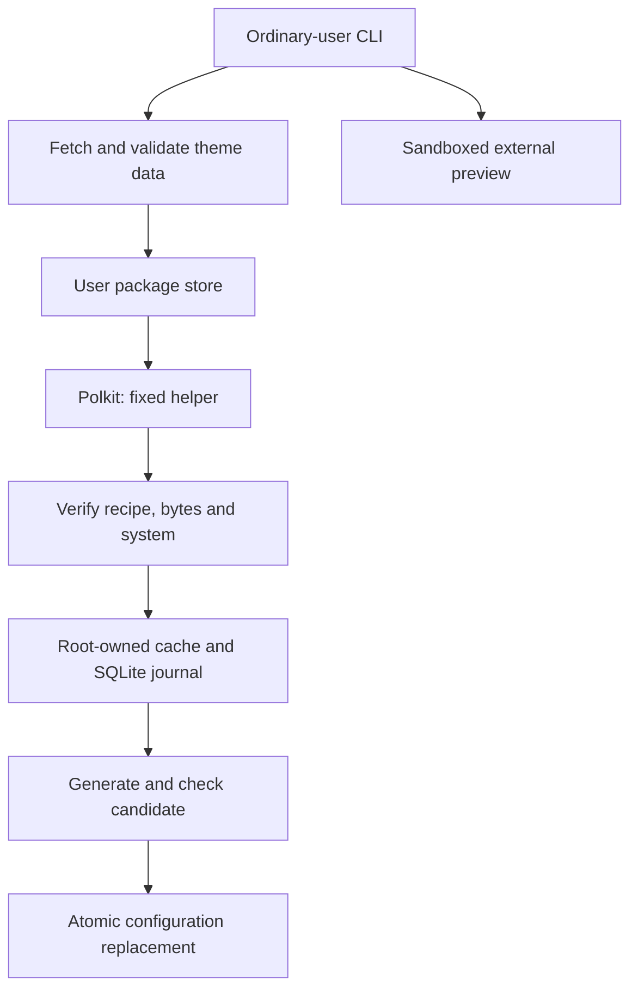

# Architecture

The CLI handles arguments and output. Packages under `internal/` hold ingestion, validation, planning, receipts, transactions and preview. The fixture engine remains available through `--root`. The shared Linux activation engine remains in `internal/debian`, with explicit Debian, Ubuntu, Kali and Arch profiles.

Go supplies archive, compression, TLS, hashing, JSON and image decoding. `modernc.org/sqlite` supplies receipts and journals. Original code is MIT. No theme-manager installer or GPL renderer implementation is bundled.

## Packages and plans

A revision identifies its recipe, file inventory and content digest. Fetch stages files beside the final store before promotion. All assets and notices are retained. The user store is owned by the caller; the helper never trusts its database or paths. It receives bounded file bytes, checks the recipe against its compiled catalog, and reconstructs the inventory independently.

The helper keeps data and journals under `/var/lib/grubmgr`, protected from ordinary users. Installed revisions live under `/boot/grub/themes/grubmgr/NAMESPACE/NAME/REVISION`. Removed and failed revisions are retained; garbage collection is deferred. A failed root-cache import can leave an unused staging directory, never a partially published revision.

Planning reads the current environment and receipts. A token binds the action, target, variant, package revision and system fingerprint. Apply takes the grubmgr and distro package locks, rebuilds the plan, and rejects a changed token. Tokens carry no command or destination path. Plans themselves create no state files. Access to the root store, including planning and status, goes through Polkit.

`install` copies assets and records them. `switch` selects an installed revision. `remove` deactivates an active revision and retains its files. Later rollback selects the retained theme that preceded a committed transaction. An unmanaged prior theme is refused because its assets cannot be verified.

## Transactions

Both engines use `planned → prepared → assets_staged → settings_staged → candidate_validated → activated → committed` and the existing SQLite transaction records. SQLite uses full synchronous commits; database commits do not make filesystem changes atomic.

The Linux backend changes only `GRUB_THEME` in `/etc/default/grub`. It runs the profile's fixed `grub-mkconfig` with an output candidate at `/boot/grub/.grubmgr-TRANSACTION.cfg`, checks that candidate with `/usr/bin/grub-script-check`, verifies the theme reference and Linux entries, and replaces `/boot/grub/grub.cfg` by a synced rename. Existing file owner and permissions are preserved. Unexpected extended attributes are refused.

The journal records original bytes and expected written hashes before activation. Immediate recovery restores exact bytes only when the current files match the original or expected state, then verifies restoration. A conflicting administrator edit produces `recovery_required`. Later rollback regenerates from current kernels instead of restoring an old whole-file configuration.

Root-owned assets are retained on errors, including when an external edit may refer to them. The helper coordinates dpkg updates using POSIX locks and its own operations using `flock`; process death releases those locks. Pacman's exclusive lock needs a durable ownership file: an interrupted helper's lock is reclaimed only when inode identity and contents still match. A foreign lock is never removed. A root administrator can still change files concurrently. Fingerprint checks detect observed drift but are not isolation from another root process.

## Fixture differences

Fixtures use synthetic generation and user-owned stores. Linux fixture replacement uses rename; Windows fixture writes are journaled but not atomic. Fixture locks use exclusive files and may need manual removal after a killed process. These limits do not describe the separate Debian helper. No fixture success proves a boot.

## Preview

The optional `grub2-theme-preview` 2.10.0 process constructs a boot image from a generated menu. Bubblewrap exposes read-only system tools and one theme, a private temporary filesystem, and one output directory. The fixed QEMU adapter uses TCG, no networking, read-only generated media and a bounded runtime. It captures GRUB through QMP. A preview image is visual evidence, not physical boot verification.

See [Linux targets](linux-support.md), [the Debian backend](debian-backend.md) and [VM tests](vm-testing.md) for layouts and evidence.
