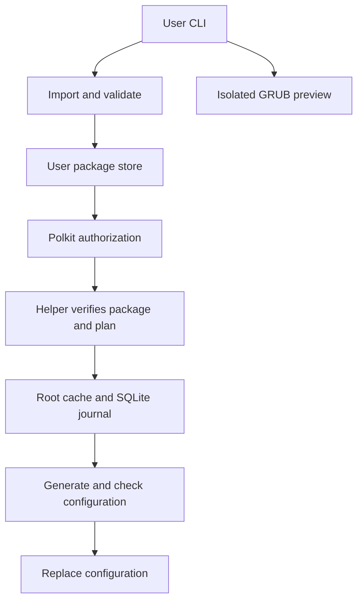

# Architecture

The Go CLI uses shared packages for ingestion, validation, planning, receipts, transactions and preview. `internal/debian` contains the Linux activation service for Debian, Ubuntu, Kali and Arch. `internal/backend` and `internal/transaction` provide the synthetic fixture engine selected by `--root`.



Go supplies archive, compression, TLS, hashing, JSON and image decoding. `modernc.org/sqlite` stores receipts and journals. GRUB, Polkit and the preview stack are external system tools; see [reuse decisions](reuse-plan.md).

## Packages and plans

A revision identifies its recipe, file inventory and content digest. Imports are staged on the package store's filesystem, validated, then promoted to a revision directory. Assets and license notices share the same inventory.

The Linux helper receives bounded file bytes and a manifest. It checks the recipe against its compiled catalog and reconstructs the inventory independently. User-owned receipts and paths have no authority over the root store.

| Store | Location and purpose |
| --- | --- |
| User imports | XDG data directory; fetched content and manifests |
| User receipts | XDG state directory; SQLite package records |
| Preview output | XDG cache directory; images and logs |
| Helper state | `/var/lib/grubmgr/{data,state,cache}`; root-owned imports, receipts and journals |
| Installed assets | `/boot/grub/themes/grubmgr/NAMESPACE/NAME/REVISION` |

Planning reads the current environment and receipts. Its token binds the action, target, variant, package revision and system fingerprint. Apply acquires the manager and distro package locks, rebuilds the plan and compares tokens. A changed fingerprint requires a new plan. Root-store operations, including planning and status, require Polkit authorization.

`install` copies assets and records them. `switch` selects an installed revision. `remove` clears the installed state and deactivates the revision if active, retaining its files. `rollback` selects the managed theme that preceded a committed transaction. An earlier unmanaged theme cannot be restored because its assets are outside the receipt inventory.

## Transactions

Both engines record these phases:

```text
planned → prepared → assets_staged → settings_staged
        → candidate_validated → activated → committed
failure → recovering → rolled_back | recovery_required
```

The Linux backend edits `GRUB_THEME` in `/etc/default/grub`, preserving unrelated bytes. The profile's fixed `grub-mkconfig` writes `/boot/grub/.grubmgr-TRANSACTION.cfg`. The helper runs `/usr/bin/grub-script-check`, checks for the selected theme and Linux entries, and replaces `/boot/grub/grub.cfg` with a synced rename. It preserves file ownership and permissions; targets with extended attributes require a separate implementation.

The journal records original bytes and expected hashes. Immediate recovery restores snapshots when the current files match either the original or expected state, then verifies the restored bytes. A conflicting edit retains the journal with `recovery_required`. Later rollback regenerates configuration with the current kernels and the retained theme.

SQLite uses full synchronous commits. Configuration replacement, asset staging and database commits are separate filesystem operations coordinated by the journal. Root-owned assets are retained after failure and removal; garbage collection is unimplemented.

## Concurrency

The helper uses `flock` for its own operations and POSIX locks for dpkg. Process exit releases those locks. Pacman's exclusive lock uses a durable ownership file; recovery reclaims the lock only when inode identity and contents match. Other administrators can bypass these advisory locks, so apply and recovery also check configuration fingerprints.

## Fixtures

Fixtures use synthetic configuration generation and user-owned stores. Linux replacement uses rename. Windows writes use the recovery journal and in-place replacement. Exclusive lock files may need manual removal after a killed fixture process; see [fixture recovery](testing.md#recovery-demo).

Fixture tests cover package and transaction behavior. The separate VM suite covers GRUB generation, authorization and boot integration.

## Preview

The optional `grub2-theme-preview` 2.10.0 process constructs a boot image from a generated menu. Bubblewrap exposes read-only system tools and one theme, a private temporary filesystem, and one output directory. The fixed QEMU adapter uses software emulation, read-only generated media, disabled networking and a bounded runtime. It waits for the menu, captures a frame through QMP and writes a PNG.

Preview checks appearance in guest GRUB. Activation support is determined separately by the [Linux profiles](linux-support.md).
