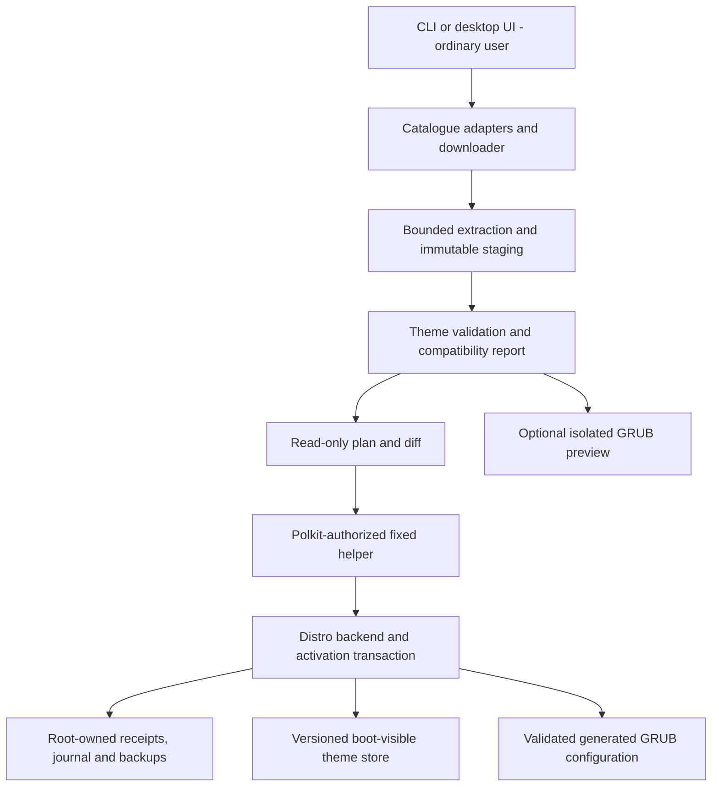

# GRUB Manager reuse plan and architecture

Research began **2026-10-04**; plan completed **2026-10-05**, America/Toronto. This is the original design record from before implementation.

This is the original design record. Current implementation and test scope: [architecture](architecture.md), [Debian backend](debian-backend.md), [Phase 2 verification](phase2-verification.md).

Companion: [ecosystem-audit.md](ecosystem-audit.md).

## Product contract

grubmgr manages **community theme packages for an already installed, supported GRUB setup**. Users can discover a theme, fetch a specific revision, validate it, preview it, inspect an installation plan, activate it and return to a previous theme.

A package consists of theme data and its provenance. It does not grant permission to execute a community installer, alter boot entries or reinstall a bootloader. The original engineering belongs in package identity, compatibility, validation, activation and recovery.

The first release should work with a small reviewed catalogue and one tested distro family. Broader distro support is earned through isolated VM tests, not inferred from the presence of a similarly named command.

## Reuse decisions

These decisions distinguish runtime dependencies, source candidates and independently implemented behavior. **Nothing below has been copied into application source during this audit.**

| Component / responsibility | Decision | Reason and license condition |
| --- | --- | --- |
| Installed GNU GRUB utilities | Reuse as distro-provided external tools | GRUB remains the renderer/configuration authority. Use the distro's supported generator and script checker through fixed backend operations; do not copy its parser/runtime. Utilities are not run during this audit. |
| [grub2-theme-preview][P11] | Integrate as optional, separately installed CLI | Mature real-GRUB preview. GPL-2.0-or-later; retain independent packaging/CLI boundary. Pin/test release 2.10.0 and supported distro versions. Maintenance mode means feature expansion must live in our adapter or a separately maintained fork. |
| QEMU, OVMF, xorriso, mtools | Reuse system packages through preview integration | Do not implement virtual machines, firmware or image construction. Prefer distro security updates. If redistributing, inventory each component and firmware's own license; QEMU's [official license page](https://www.qemu.org/docs/master/about/license.html) is not a license for the entire stack. |
| Archive decoding | Reuse maintained standard-library decoders; consider [libarchive](https://libarchive.org/) only when format coverage requires it | Own the extraction policy, not compression algorithms. MVP accepts only audited ZIP and TAR variants. libarchive's BSD-family terms and its bindings/dependencies must be checked at the chosen version. |
| Local package database | Reuse [SQLite](https://www.sqlite.org/copyright.html) | Upstream deliverable library is public domain; selected language binding has separate terms. Store receipts and transaction state. SQLite atomicity does not make /boot and /etc changes atomic. |
| Hashing, TLS, HTTP, JSON/schema parsing | Reuse maintained language/platform libraries | No custom crypto, downloader protocol stack or general-purpose JSON parser. Pin actual dependencies and licenses at implementation. |
| Polkit authorization | Reuse distro Polkit via a fixed installed helper | Polkit authenticates; our helper validates every operation. [pkexec does not validate arguments](https://polkit.pages.freedesktop.org/polkit/pkexec.1.html). No policy that grants a general shell/interpreter elevated access. |
| [P06 lint/PF2][P06-internal-lint-lint-go] | Conditional source-adaptation candidate | MIT; preserve Sarbojit Rana's copyright/license and provenance. Review tests and correct assumptions before use. If the core is not Go, independently implement the small necessary checks from the GRUB format instead of adding a Go service solely for this code. |
| P06 installer/rollback | Do not adopt | Useful invariant ideas, but incomplete asset rollback, generic EFI fallback and direct regeneration are unsuitable foundations. |
| [Gorgeous-GRUB][P09] | Discovery/reference source | Independently curated factual upstream links and package recipes. No bulk copy of screenshots/descriptions/catalogue without permission or a clear license. |
| [OCS protocol](https://wiki.freedesktop.org/www/Specifications/open-collaboration-services/) | Implement a small adapter using ordinary HTTP | Existing catalogue protocol avoids inventing a marketplace API. Provider responses are discovery data, not trusted install manifests. |
| GNOME Theme Manager client/UI | Pattern reference; no source import now | GPLv3 combination depends on grubmgr's chosen license. Borrowing the protocol behavior avoids needing its broad privileged installer. |
| theamify / small MIT managers | UX reference; selective utility reuse only if worthwhile | Doctor, fetch/apply distinction, search and variants are useful. Their shell engines add more backend debt than value. |
| GrubStudio | Design reference; hold source reuse | ISC declaration exists, but licensing notices/coverage need clarification; inspected preview/backend are scaffolds. |
| GRUB Customizer | Interoperability reference, not a dependency | Its boot-entry/proxy model is outside our theme-package contract. Detect affected configurations and refuse untested activation. |
| Theme assets from vinceliuice / Dark Matter / others | Fetch approved upstream artifacts, package separately | Top-level GPL/MIT metadata does not settle every font, icon, screenshot or third-party artwork's rights. Keep per-package licenses and credits. |
| Background Cycler | Defer | In-place changes defeat immutable versions. A later feature may create a derived package with its own digest. |

Use mature commodity libraries instead of copying helpers merely because they are permissively licensed. No complete reviewed manager is selected for a fork.

## Licensing and attribution gate

The current workspace has no declared grubmgr license. That does not prevent this design work; it **does prevent treating any proposed source import as already approved for distribution**.

Before incorporating code or shipping an artifact:

1. Record grubmgr's own license and the exact distribution model.
2. Identify upstream repository, immutable commit/release, exact files, copyright holders, SPDX expression or explicit grant, modifications and transitive dependencies.
3. Check compatibility for the actual integration: copied/linked code, independent system executable, or separate theme-data package.
4. Preserve upstream file headers and full license text. Add a third-party manifest and human-readable notices for imported code. Do not replace upstream authors with a repository username.
5. Preserve theme notices inside the installed theme revision and expose author/source/license through info and the UI. Keep notices in exported packages and backups too.
6. Treat missing/unclear grants as a hold for protected-code/art copying. Source availability, a screenshot URL and attribution are not substitutes for permission.
7. Recheck changed grants and new files on every upgrade. A previously accepted version does not automatically approve a later one.

MIT code can be adapted with its notices. GPL code is not universally incompatible: a compatible combined project may use it while fulfilling GPL obligations. This plan avoids a premature license commitment by favoring independent system tools and fresh implementation of the domain layer. [GNU's aggregation guidance](https://www.gnu.org/licenses/gpl-faq.en.html#MereAggregation) explains why process boundaries alone are not a universal legal exemption; [GitHub's licensing guidance](https://docs.github.com/en/repositories/managing-your-repositorys-settings-and-features/customizing-your-repository/licensing-a-repository) explains missing grants.

Initial reuse ledger:

| Candidate | Original notice / license evidence | Status |
| --- | --- | --- |
| P06 lint/PF2 | Copyright 2026 Sarbojit Rana, MIT [LICENSE][P06-LICENSE] | Candidate only; no copied implementation |
| P01 utilities | Copyright 2025 Ferdi Izzulhaq, MIT [LICENSE][P01-LICENSE] | Not selected |
| P02 utilities | Copyright 2024 Khalil, MIT [LICENSE][P02-LICENSE] | Not selected |
| P04 gallery utilities | Copyright 2026 Nightworker, MIT [LICENSE][P04-LICENSE] | Not selected |
| P07 CLI utilities | Copyright 2026 Don Artkins, MIT [LICENSE][P07-LICENSE] | Not selected |
| P10 utilities | Copyright 2026 droopi, MIT [LICENSE][P10-LICENSE] | Not selected |
| P11 external preview | Copyright Sebastian Pipping; GPL-2.0-or-later [header][P11-grub2_theme_preview-__main__-py] | Integrated in Phase 2 as a separate external CLI; no vendored source |
| Gorgeous-GRUB media/catalogue | No general grant found | No mirroring approved |
| Bundled theme/font artwork | Package/file-specific, not yet selected | No asset reuse approved |

The proposed third-party manifest fields are: component, version/commit, origin, file scope, integration mode, license, copyright, local notice path, modifications, review date and reviewer. A notice file should describe actual imports, not falsely imply every research reference is bundled.

## Architecture

Use a shared core so the CLI and eventual GUI cannot implement different validation or activation rules. The design is independent of UI toolkit; choose the implementation language once packaging and the selected reuse candidates are settled.

| Module | Owns | Must not do |
| --- | --- | --- |
| Catalogue adapters | Search, upstream identity, metadata cache, catalogue freshness | Select system paths or execute installers |
| Fetch/stage | Network, digest verification, decompression, file inventory | Obtain root or mutate /boot or /etc |
| Validator | Theme syntax subset, assets, resources, policy/compatibility findings | Execute theme scripts or claim boot certification |
| Planner | Requested state, diff, preconditions, artifact/version identity | Change configuration during browsing/dry-run |
| Preview adapter | Disposable image/VM, sanitized display fixture, cancellation/logs | Attach host boot disks, expose host secrets or run as root |
| Privileged helper | Root staging, independent checks, locking, fixed operations | Network, arbitrary commands, caller-chosen destination paths |
| Distro backend | Supported layout detection, limited defaults changes, candidate generation and verification | Reinstall GRUB, edit kernel command lines, disable BLS/Secure Boot |
| State store | Package receipts, selected version, transaction recovery, attribution | Claim filesystem changes are covered by a database transaction alone |

The helper is a root-owned, package-installed executable with a versioned request schema. It must not load code, plugins, Python modules, shell helpers or configuration from user-writable application directories.

## Package and catalogue model

Catalogue metadata and local installed state are different objects. A remote catalogue never directly supplies privileged commands.

| Field group | Required information |
| --- | --- |
| Identity | Schema version; stable namespaced theme ID; display name; upstream author and project URL |
| Revision | Human version if supplied; immutable Git commit or release-asset identity; artifact SHA-256; catalogue recipe revision |
| Source | Provider and content ID, canonical download URL, upstream revision, exact theme subdirectory and entry file |
| Layout | Explicit file inventory, sizes/digests, variant IDs, resolution options and font/image references |
| License | Per-package SPDX/grant evidence; notice paths; font/image exceptions; distribution permission state |
| Compatibility | Tested backend/GRUB/architecture/firmware combinations; required capabilities; known exclusions |
| Preview | Optional permitted media, its attribution, and whether it is a screenshot, approximation or GRUB VM result |
| Installed receipt | Artifact and extracted-tree digests, selected variant, physical path, timestamps, origin, validation tool version, selected/pinned status |
| Update policy | Allowed upstream/ref/channel; pin; last checked revision; candidate revision; changed source/license warnings |

Additional rules:

- Resolve mutable branches/tags to immutable revisions at fetch time. Store both upstream version and recipe version; a packaging correction may change without an upstream release.
- Downloaded artifacts must match the reviewed digest before staging. A hash from the same unauthenticated source is not a complete authenticity story.
- Start with a **reviewed catalogue snapshot shipped with the application release**. Remote catalogue refresh may discover candidates, but cannot silently authorize activation.
- Before adding unattended remote catalogue updates, select and review a maintained implementation of a metadata-signing/update framework such as [TUF](https://theupdateframework.io/). Do not design a home-grown signature protocol.
- Unknown or ambiguous license/layout results remain browse-only until reviewed. Local imports preserve supplied notices and report unknown provenance; publication/export remains gated by rights verification.
- Do not guess the first theme.txt in a repository. Ambiguous roots/variants require an explicit packaging recipe or a user selection before planning.
- No package hooks, post-install commands or executable theme plugins in the MVP. Themes requiring generation must provide approved ready-made assets or use a separately reviewed, unprivileged, isolated build recipe in a later phase.
- A removed upstream release must not invalidate a retained local rollback version. Keep required artifacts locally according to retention rules.
- Detect installed unmanaged themes as read-only discoveries. Explicit adoption imports a new immutable revision; it does not claim ownership of distro-managed files.

## Storage and ownership

Proposed logical storage:

| Location | Purpose |
| --- | --- |
| User XDG cache | Downloads, catalogue metadata and disposable preview outputs |
| User XDG data | Favorites and unactivated local imports |
| /var/lib/grubmgr | Root-owned database, durable transaction journal, receipts and snapshots |
| Backend-approved boot-visible theme directory / grubmgr / ID / DIGEST | Immutable activated theme assets |
| Backend-approved defaults fragment, or a narrowly patched defaults file | Manager-owned theme setting |
| Backend-confirmed real grub.cfg | Generated configuration; never chosen through a broad EFI wildcard |

The backend chooses the physical theme directory based on boot readability and available space. Do not assume /usr/share is readable by GRUB when the root volume is encrypted. Never change permissions to make active boot assets user-writable.

Retain the active version, previous known-good version and all versions referenced by pending transactions/backups. Garbage collection deletes only manager-owned, unreferenced revisions and exposes a dry-run. Removing a theme first switches/deactivates it successfully; assets are collected afterward.

## Validation and preview

Validation produces machine-readable findings with code, severity, file/location, explanation and suggested remedy. A successful lint is not a guarantee that a physical system will boot.

1. **Package boundary:** allow supported archive formats only; reject absolute/escaping paths, links, special files, ambiguous duplicate paths and unsupported metadata. Enforce limits on bytes downloaded, actual expanded bytes, member count, nesting and image/font resource consumption.
2. **Extraction:** use a maintained decoder in an unprivileged isolated working directory; apply identical policy to every accepted format. Avoid fallback extraction tools that silently bypass checks. Even library extraction filters are not complete safety policies: see [Python's extraction guidance](https://docs.python.org/3/library/tarfile.html#extraction-filters).
3. **Theme structure:** parse the supported GRUB theme grammar as data; require an explicit entry file and validate referenced paths against the package root. Check fonts by embedded PF2 names, not filenames alone. Preserve relative-path semantics.
4. **Assets:** verify dimensions, decodability, known capabilities and rendering limits for the supported GRUB build. Include nested directories and case-sensitive lookup. Treat P06's PNG rule as an upstream implementation assumption to test, not a universal specification.
5. **Compatibility:** report gfxterm, boot-readable storage, firmware/architecture and known Secure Boot/font limitations. Preserve serial-console behavior; do not silently replace terminal settings to make a theme display.
6. **Candidate boot configuration:** use the distro's GRUB script checker and backend-specific structural checks. The script checker is not a theme linter; it cannot establish theme path accessibility or successful boot.

Preview has three explicit levels:

| Level | Meaning |
| --- | --- |
| Screenshot | Upstream/provided image; may show another resolution or variant |
| Approximate layout | Fast local model; useful for browsing/authoring but not authoritative |
| GRUB VM preview | Real GRUB in a disposable QEMU image; strongest visual check, still not host boot verification |

Use grub2-theme-preview for the third level. Supply a generated non-sensitive menu fixture, not its default host configuration. Never attach host disks or pass arbitrary --add/--qemu paths from catalogue data. Disable guest networking, restrict file access, bound resources and control timeouts. The inspected upstream CLI supports an alternative QEMU executable; a trusted packaged launcher can enforce a fixed policy without modifying the upstream preview engine. Verify that integration against actual supported versions before shipping.

Keep catalogues, image decoders and VM work outside root. A first version can omit an approximate renderer entirely: licensed screenshots plus optional QEMU provide useful coverage without maintaining a second GRUB renderer.

## Distro backend contract

Each backend implements: detect, assess_support, read_theme_state, plan_changes, stage_assets, snapshot, generate_candidate, validate_candidate, activate and recover. Methods have typed results and stable error codes, not arbitrary shell-command strings.

Detection combines distro identity/version, bootloader evidence, firmware, active mounts, symlink targets, installed GRUB tools, defaults/fragments and ownership. File existence alone does not identify the active bootloader. Multiple plausible layouts produce an unsupported/ambiguous result, not a fallback guess.

| Environment | Planned handling | Initial release status |
| --- | --- | --- |
| Conventional Debian/Ubuntu | Respect supported defaults/fragments and /boot/grub; fixture-specific generator adapter | First implementation target after VM validation |
| Conventional Arch | /boot/grub and distro generator; boot-readability and kernel-entry fixtures | Next adapter; no support claim yet |
| Conventional Fedora 34+ | Confirm /boot/grub2 target, protect EFI stub, preserve BLS and grubenv | Separate gated adapter |
| openSUSE conventional GRUB | Protect snapshot/custom-menu integration; distinguish BLS/new layouts | Deferred until tested |
| NixOS | Export a pinned theme package/declarative option integration | Read-only initially |
| Atomic/transactional distributions | Dedicated ownership/update integration | Read-only initially |
| Secure Boot + custom fonts | Explicit tested capability results; no policy changes | Unknown combinations blocked from activation |
| GRUB Customizer proxies or complex defaults | Explain conflict and preserve user state | Read-only until fixtures prove interoperability |
| systemd-boot, rEFInd, unknown loader | Explain unsupported loader | No activation or migration |

Fedora's [official documentation](https://fedoraproject.org/wiki/GRUB_2) explicitly warns against regenerating its EFI stub. NixOS exposes a [declarative GRUB theme option](https://nixos.org/manual/nixos/unstable/options). Those differences should appear in separate backends.

Only manage appearance keys that the plan explicitly lists. The default operation changes GRUB_THEME; graphics-mode changes are separate explicit choices. Do not alter default OS, kernel arguments, timeout, os-prober, BLS, partition layout, EFI variables or bootloader binaries as a side effect of applying a theme.

Use a manager-owned defaults fragment only where the installed distro generator demonstrably loads it with the required precedence. Otherwise use a minimal preserving edit of an understood assignment. Do not source a user's imported defaults as shell code to inspect it. Complex shell expressions/conflicting fragments should cause an actionable refusal, not a lossy rewrite.

## Privileged helper and plan integrity

Browsing, fetching, validation, preview and dry-run are ordinary-user operations. Authentication occurs only for an explicit plan application or recovery action.

The helper accepts a small schema of operation, package identity/digest, variant and expected system state. It independently derives destinations and approved generator paths. It must reject raw shell snippets, arbitrary paths/programs, unknown fields and stale plans.

Before mutation, the helper:

- Creates root-owned staging and copies verified files through a bounded interface. It rechecks content hashes, file types, ownership and containment so a mutable user cache cannot substitute data after validation.
- Uses safe filesystem operations that do not follow unexpected links; resolves expected system symlinks only through backend rules and verifies their targets.
- Binds authorization to the caller, requested operation, artifact digest and detected layout. A plain JSON file written by the GUI is not a trusted installation instruction.
- Acquires a grubmgr transaction lock, checks mount/free-space state and compares configuration/package fingerprints with the plan.
- Uses fixed absolute executable paths and an explicit environment. No password storage, long-lived unrestricted root UI or runtime downloading.
- Returns structured progress and separate failure/recovery status. Cancellation before mutation is clean; after mutation begins it completes or recovers the transaction.

A grubmgr lock does not lock the OS package manager. Backends must coordinate with native updates where a supported lock exists and detect kernel/configuration drift before and after candidate generation. Where safe coordination cannot be established, refuse activation or require a quiescent supported workflow. Do not claim perfect exclusion based only on our own lock.

## Transaction and rollback semantics

Filesystem changes may span /var, /etc and /boot. This is a **journaled recoverable transaction**, not a single atomic database commit.

Proposed durable phases:

    planned -> prepared -> assets_staged -> settings_staged
            -> candidate_validated -> activated -> committed
    any mutation failure -> recovering -> rolled_back OR recovery_required

1. **Plan:** use already fetched/validated content. Show exact theme/version/variant, setting changes, paths, compatibility result, required privilege and recovery scope. Dry-run never regenerates configuration.
2. **Prepare:** lock, independently revalidate the artifact and system fingerprints, check capacity, write/fsync journal, and snapshot the precise settings and current generated configuration with permissions/metadata.
3. **Stage assets:** put the new revision in a unique manager-owned final directory without replacing the old revision. Verify it is boot-readable. Failed/unreferenced staging can be collected later.
4. **Stage settings / generate candidate:** prefer a tested backend method that lets the generator consume staged settings. Some generators read live defaults without an alternate-file option; for those, journal and apply the narrow settings change while retaining the old bootable grub.cfg, then generate to a temporary candidate on the target filesystem. This limitation must be covered by crash tests. Never assume a generic alternate-defaults flag exists.
5. **Validate:** check syntax, expected theme references, preserved boot-entry identities and kernel/initrd/chainloader references, custom includes and backend-specific BLS/UKI state. Do not equate an unchanged menuentry count with an unchanged boot menu. Detect concurrent kernel/defaults changes and replan instead of overwriting them.
6. **Activate:** preserve metadata/labels, fsync and atomically replace the generated configuration on its own filesystem only after the candidate passes. Keep all previous assets and the previous configuration snapshot.
7. **Commit:** update the receipt/selected version and durable journal. If the process stops between filesystem activation and database update, recover by inspecting recorded hashes/phases rather than guessing from a missing success message.
8. **Recover:** restore only known transaction-owned changes when preconditions still match. Verify every restore and propagate failures as recovery_required. Do not report "boot unchanged" merely because a restore was attempted.

Two distinct rollback modes are required:

- **Immediate failure recovery:** when no external state changed, restore the exact pre-transaction settings/generated file and retain their referenced assets.
- **User-requested rollback later:** select a retained prior theme revision and generate a new configuration against the **current** kernel/boot inventory. Do not overwrite today's configuration with an old whole-file snapshot that may reference removed kernels or erase new entries.

Backups need a manifest, content digests, referenced assets, configuration snapshots, detected backend and recovery instructions. Preserve SELinux labels/ownership through the backend where applicable. Retention is explicit and cannot remove the only rollback assets.

There is no promise of automatic recovery after an unbootable machine restarts. Provide an offline recovery guide and an inspectable backup location. VM preview and configuration checks reduce risk but cannot certify hardware boot behavior.

## CLI and UI contract

The CLI is the first frontend; a later GUI uses the same core and plan protocol.

| Operation | Behavior |
| --- | --- |
| doctor | Read-only detection, support status, dependency and compatibility diagnostics |
| search / info | Catalogue browsing, provenance, variants, license and supported-state information |
| fetch ID@REV | Unprivileged download and immutable staging; no activation |
| validate PATH-or-ID | Structured lint/asset/policy report |
| preview ID --engine=qemu | Disposable unprivileged preview, dependency/capability diagnostics |
| list / status / history | Installed, active, unmanaged, pinned and retained versions; transaction outcomes |
| plan install/switch/remove/upgrade/rollback | Produce an inspectable diff and preconditions; no host changes |
| apply PLAN_ID | Authenticate, revalidate and execute the constrained transaction |
| upgrade --check | Compare candidates and show changes; do not install or activate |
| pin / unpin | Control selected theme update eligibility |
| rollback TRANSACTION_ID --dry-run | Plan a theme rollback against current system state |
| recover | Inspect/complete a pending failed transaction through the helper |
| gc --dry-run | Show only unreferenced manager-owned revisions eligible for deletion |

Install makes a version available; switch activates it. A convenience workflow may combine them only when the plan states both effects. Upgrading the active theme requires an explicit activation plan; fetching an update cannot silently change boot appearance.

Provide --json, stable exit codes and noninteractive refusal when authentication/selection is needed. Keep progress on stderr and machine-readable output on stdout. Ship the application through native packages; catalogue refresh and theme upgrades do not self-update the executable or add repositories.

UI states should be understandable: Available, Downloaded, Validated, Installed, Active, Update available, Pinned, Unsupported, Recovery needed. Show the upstream author and source. Compatibility unknown is not a green "safe" badge.

## Implementation sequence and acceptance gates

### Phase 0 — decisions and fixtures

Record project license, package schema, backend/privilege interfaces and dependency choices. Select 10–15 themes with explicit rights, varied layouts and complete asset provenance. Prepare disposable VM images and synthetic configuration fixtures; no personal host bootloader work.

Exit: rights ledger complete for selected fixtures; one documented distro/version/firmware support target; read-only tests cannot mutate host paths.

### Phase 1 — read-only CLI and package ingestion

Build doctor/search/info/fetch/validate/status and the local manifest/receipt model. Start with local imports and a shipped reviewed catalogue. Optional QEMU integration can follow independently.

Exit: repeatable artifact digests, bounded extraction, clear unknown-license/unsupported states, no privileged execution, and useful reports for every selected fixture.

### Phase 2 — one backend and recoverable activation

Implement the fixed helper, Polkit policy, preserving configuration edits, versioned assets, journal, candidate checks and rollback for conventional Debian/Ubuntu fixtures.

Exit: each failure point in the table below either leaves the original state usable or records a verified, actionable recovery state. A real disposable VM boots before and after apply/remove/rollback.

### Phase 3 — updates and additional distro adapters

Add explicit update candidates, pins, drift handling and retention. Then Arch, Fedora and other backends separately. Remote registries remain discovery sources until their recipes are reviewed.

Exit: later rollback preserves newly installed kernels; Fedora EFI stub and BLS invariants are preserved; unsupported layouts are refused.

### Phase 4 — GUI and wider catalogue

Add a thin graphical frontend, richer catalogue browsing and optional authoring/approximate preview only after transaction behavior is stable.

Exit: GUI/CLI share the same validations and transaction results. No source-specific installer scripts or root UI have been introduced.

## Verification plan for implementation

These are future tests, **not tests run during this audit**.

| Scenario | Required evidence |
| --- | --- |
| Missing/ambiguous theme root, nested assets, PF2 names, supported image variants | Clear structured diagnostics; accepted fixtures match target GRUB rendering |
| Unsupported archive members, duplicates, oversized expansion, mutable staging | Rejected before system mutation; bounded work and no paths outside staging |
| Downloads interrupted, wrong digest, moved tag, changed license/source | Existing installed/active revision remains unchanged; candidate requires review |
| Missing dependency, unsupported distro, non-GRUB loader, encrypted unreadable path | Actionable read-only result; no automatic repair/install |
| Polkit denied/cancelled; helper schema/version mismatch | No mutation and correct nonzero result |
| Concurrent grubmgr calls and native kernel/config updates | Serialization or detected drift; no stale overwrite |
| Failure/disk full/process interruption at each durable phase | Valid old config/assets or explicit verified recovery path |
| Restore failure | recovery_required, snapshot location retained, no false success |
| Apply twice, remove inactive/active, rollback after kernel update | Idempotent state transitions; active assets not deleted; current boot entries retained |
| Fedora conventional BIOS/UEFI, BLS; openSUSE snapshots when supported | Stub/custom-menu/entry semantics preserved |
| QEMU with no KVM, timeout and cancellation | Preview stops cleanly, remains unprivileged and does not attach host devices |
| Package assets owned by the distro or another tool | No overwrite/deletion; explicit adoption produces a separate managed revision |
| License/notice export | Exact notices and source/version attribution retained in installed/exported package |

Use synthetic fixtures for parser/planner coverage and disposable VMs for generators, Polkit and boot integration. Do not run third-party installer test suites on the developer's host simply because they are named tests.

## Scope deliberately left for later

Theme editing, background rotation, arbitrary shell generators, cloud accounts/marketplace uploads, automatic boot repair, boot-entry reordering, bootloader installation, Secure Boot policy changes, immutable-distro mutation and unattended activation are outside the MVP.

The unresolved project license and language/toolkit selection are implementation decisions, not reasons to repeat this audit. The architecture and reuse choices above can guide the next implementation step once those decisions are recorded.

[P01-LICENSE]: https://github.com/ferdiizzulhaq/GRUB-Theme-Manager/blob/8da2d2e9becee3f183c4a86c44fcefdd2cda76fc/LICENSE

[P02-LICENSE]: https://github.com/KHLALA-Gh/grub-themes-manager/blob/69b99ee09caef13deb2146fbe8cbcffc6a8f8b32/LICENSE

[P04-LICENSE]: https://github.com/GuideOS/guideos-grub-theme-manager/blob/aeca3a34cc4dfbae8ab194757e65cdc78e9b9d5f/LICENSE

[P06-LICENSE]: https://github.com/sarbojitrana/grub-themes/blob/ccf55b75eac8586e70d117de6d4e346e729cc418/LICENSE
[P06-internal-lint-lint-go]: https://github.com/sarbojitrana/grub-themes/blob/ccf55b75eac8586e70d117de6d4e346e729cc418/internal/lint/lint.go

[P07-LICENSE]: https://github.com/DonArtkins/theamify/blob/22aae2563cd4bd15d587a35bd94026738d0f8d2f/LICENSE

[P09]: https://github.com/Jacksaur/Gorgeous-GRUB

[P10-LICENSE]: https://github.com/FLEXIY0/gorgeous-grub-installer/blob/a207441057d6abd5f9b1603820fa00514696f5fe/LICENSE

[P11]: https://github.com/hartwork/grub2-theme-preview
[P11-grub2_theme_preview-__main__-py]: https://github.com/hartwork/grub2-theme-preview/blob/72cf7c82c5d0a62090c75ebb7f71b09d66647fae/grub2_theme_preview/__main__.py

